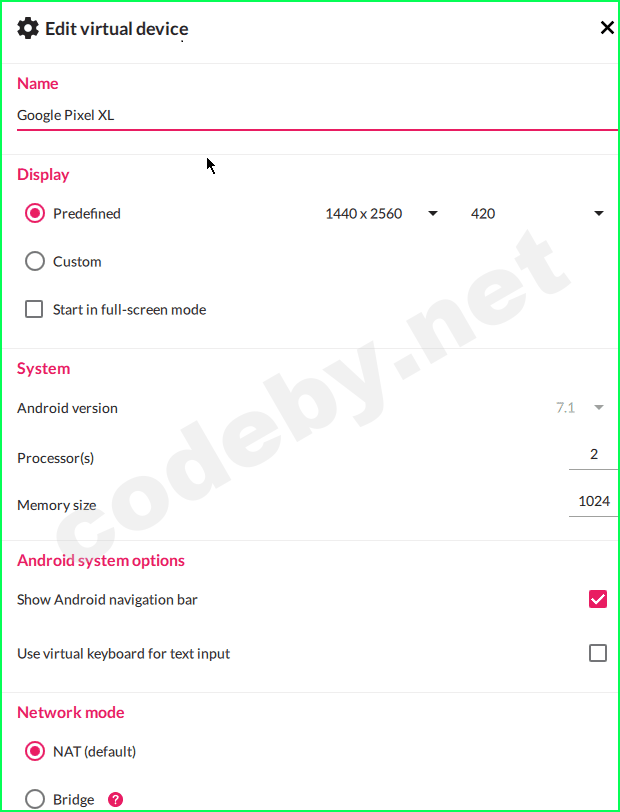
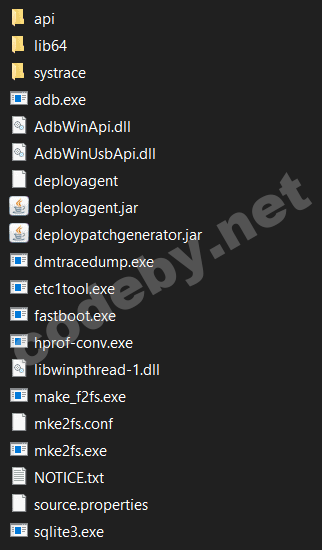
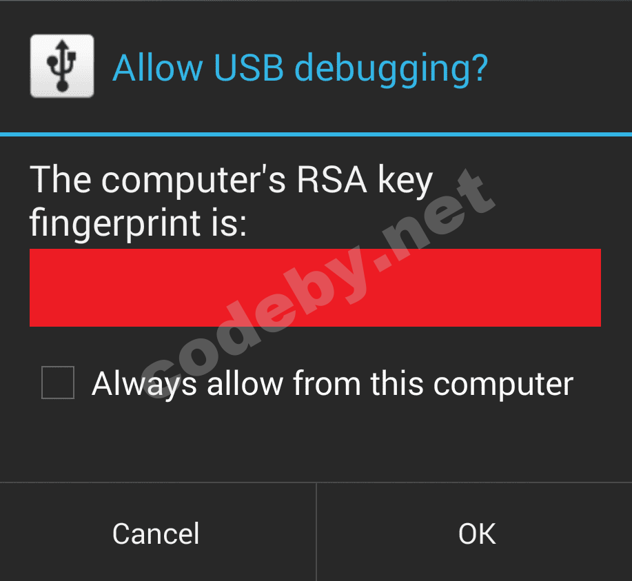
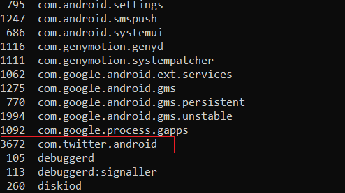
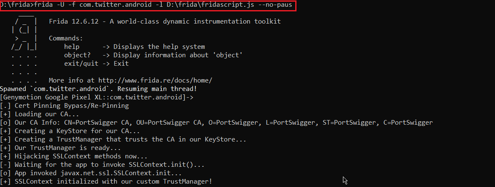
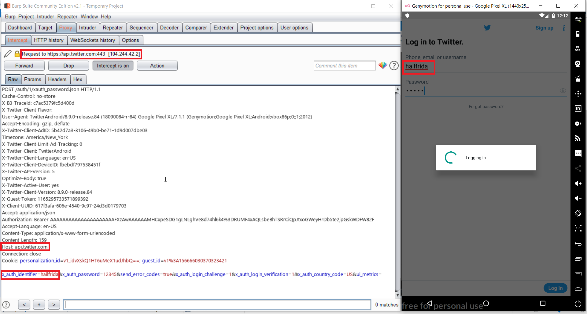

# Универсальный обход SSL pinning для андроид приложений
 - Автор перевода [@Tayrus](https://codeby.net/members/tayrus.74954/)
 - [Ссылка](https://codeby.net/threads/universalnyj-obxod-ssl-pinning-dlja-android-prilozhenij.68902/) на перевод
 - [Оригинал](https://infosecwriteups.com/hail-frida-the-universal-ssl-pinning-bypass-for-android-e9e1d733d29) на английском


Привет всем, в этой статье, я объясню как обойти SSL pinning для андроид приложений используя Frida Framework. Я попытаюсь объяснить все в деталях,четко и понятно.

В этой статье будет рассмотрено:

1. Введение в Frida и SSL pinning
2. Требования
3. Настройка и установка
4. Установка Frida Server
5. Установка BurpSuite
6. Пушинг CA сертификата прокси
7. Инжект скрипта для обхода SSL pinning
8. Все вещи в двух словах
9. Устранение неисправностей


## 1. Введение в Frida и SSL pinning

Frida Framework это конечная для обхода SSL pinning.
Согласно фриде ([веб сайт](https://frida.re/)):

Это Greasemonkey для приложений, или, говоря более техническими терминами, это dynamic code instrumentation toolkit.
Он позволяет инжектить фрагменты JavaScript или вашей собственной библиотеки в приложения на Windows, macOS, GNU/Linux, iOS, Android и QNX. Frida также предоставляет вам несколько простых инструментов, построенных на API Frida. Они могут использоваться как есть, подстраиваться под ваши потребности или служить примером использования API.

В настоящее время большинство приложений реализуют SSL pinning в своем мобильном приложении. Почему же?
Давайте рассмотрим, что мы хотим безопасно обмениваться некоторыми данными между нашим устройством и сервером. Сделает ли шифрование транспортного уровня ssl передачу данных безопасной и надежной? Ну, тут есть подвох. Перед передачей данных клиент проверяет наличие SSL-сертификата сервера, соответствует ли он запрошенному имени хоста и доверенной корневой сертификации.

То, что он не гарантирует, что предоставленный сертификат является настоящим сертификатом, предоставленным сервером для запрошенного имени хоста. Таким образом, использование доверенных, хранимых сертификатов устройства не сделает передачу данных “безопасной”.

>Certificate pinning - это захардкоденный сертификат, которому доверяет удаленный сервер в самом приложении, так что он будет игнорировать хранилище сертификатов устройства и будет доверять своему собственному сертификату, который в дальнейшем приложение будет использовать для связи с удаленным сервером “безопасно”.

Обойти SSL pinning это важный шаг, который необходимо выполнить, даже когда мы начинаем динамический анализ HTTP-запросов для большинства мобильных приложений, поскольку сейчас организации больше заботятся о конфиденциальности данных и безопасной передаче данных по сети из потоков.

Frida - это фреймворк, который вводит скрипты в приложения для управления логикой приложения во время выполнения, что является более динамичным подходом для пентестинга мобильных приложений.


## 2. Требования

Давайте соберемся и выполним все требования, прежде чем выполнять наш волшебный трюк. Эта настройка занимает некоторое время в первый раз, так как список требований довольно длинный. Как только мы закончим со всеми настройками, со следующего раза это будет проще простого. Если вы застряли на любом шаге, в конце статьи есть раздел "Устранение неполадок". Рекомендуется сохранять все загруженные материалы в одной папке.

##### I. Устройство с рут правами/эмулятор:

Нам понадобится устройство с рутом или эмулятор, поскольку нам нужно заинжектить скрипт в корневой каталог устройства.
Я использую genymotion для этого. Genymotion прост в настройке и использовании, скачать можете ниже.

[Genymotion For Fun – Free Android Emulator](www.genymotion.com)
>Download Genymotion Android Emulator for free on PC, Mac and Linux. Run your favorite Android games and apps on any computer with no time limitation.

Как только мы закончим установку genymotion, нам нужно установить устройство android. Android 7 + подойдет.
Я буду использовать устройство "Google pixel XL" со следующей конфигурацией.



##### II. Установка пакета Python frida:

Установить Python для windows [отсюда](https://www.python.org/downloads/windows/).
Нам нужно установить некоторое пакеты python для frida server. Для этого введите следующие команды в терминал:

Код:
```
python -m pip install Frida
python -m pip install objection
python -m pip install frida-tools
```

или

```
pip install Frida
pip install objection
pip install frida-tools
```


##### III. adb:

Скачать platform-tools для windows можно [здесь](https://dl.google.com/android/repository/platform-tools-latest-windows.zip).



##### IV. Скачать скрипт инжекта:

Нам нужно скачать скрипт инжекта ниже, который мы будем пушить в устройство для инъекции в целевое приложение.
[Скачать](https://codeshare.frida.re/@pcipolloni/universal-android-ssl-pinning-bypass-with-frida/) frida codeshare.

Или вы можете сохранить этот код как `fridascript.js` в этой же папке c adb:
```
/* 
   Android SSL Re-pinning frida script v0.2 030417-pier 

   $ adb push burpca-cert-der.crt /data/local/tmp/cert-der.crt
   $ frida -U -f it.app.mobile -l frida-android-repinning.js --no-pause

   https://techblog.mediaservice.net/2017/07/universal-android-ssl-pinning-bypass-with-frida/
   
   UPDATE 20191605: Fixed undeclared var. Thanks to @oleavr and @ehsanpc9999 !
*/

setTimeout(function(){
    Java.perform(function (){
    	console.log("");
	    console.log("[.] Cert Pinning Bypass/Re-Pinning");

	    var CertificateFactory = Java.use("java.security.cert.CertificateFactory");
	    var FileInputStream = Java.use("java.io.FileInputStream");
	    var BufferedInputStream = Java.use("java.io.BufferedInputStream");
	    var X509Certificate = Java.use("java.security.cert.X509Certificate");
	    var KeyStore = Java.use("java.security.KeyStore");
	    var TrustManagerFactory = Java.use("javax.net.ssl.TrustManagerFactory");
	    var SSLContext = Java.use("javax.net.ssl.SSLContext");

	    // Load CAs from an InputStream
	    console.log("[+] Loading our CA...")
	    var cf = CertificateFactory.getInstance("X.509");
	    
	    try {
	    	var fileInputStream = FileInputStream.$new("/data/local/tmp/cert-der.crt");
	    }
	    catch(err) {
	    	console.log("[o] " + err);
	    }
	    
	    var bufferedInputStream = BufferedInputStream.$new(fileInputStream);
	  	var ca = cf.generateCertificate(bufferedInputStream);
	    bufferedInputStream.close();

		var certInfo = Java.cast(ca, X509Certificate);
	    console.log("[o] Our CA Info: " + certInfo.getSubjectDN());

	    // Create a KeyStore containing our trusted CAs
	    console.log("[+] Creating a KeyStore for our CA...");
	    var keyStoreType = KeyStore.getDefaultType();
	    var keyStore = KeyStore.getInstance(keyStoreType);
	    keyStore.load(null, null);
	    keyStore.setCertificateEntry("ca", ca);
	    
	    // Create a TrustManager that trusts the CAs in our KeyStore
	    console.log("[+] Creating a TrustManager that trusts the CA in our KeyStore...");
	    var tmfAlgorithm = TrustManagerFactory.getDefaultAlgorithm();
	    var tmf = TrustManagerFactory.getInstance(tmfAlgorithm);
	    tmf.init(keyStore);
	    console.log("[+] Our TrustManager is ready...");

	    console.log("[+] Hijacking SSLContext methods now...")
	    console.log("[-] Waiting for the app to invoke SSLContext.init()...")

	   	SSLContext.init.overload("[Ljavax.net.ssl.KeyManager;", "[Ljavax.net.ssl.TrustManager;", "java.security.SecureRandom").implementation = function(a,b,c) {
	   		console.log("[o] App invoked javax.net.ssl.SSLContext.init...");
	   		SSLContext.init.overload("[Ljavax.net.ssl.KeyManager;", "[Ljavax.net.ssl.TrustManager;", "java.security.SecureRandom").call(this, a, tmf.getTrustManagers(), c);
	   		console.log("[+] SSLContext initialized with our custom TrustManager!");
	   	}
    });
},0);
```

## 3. Настройка и установка

##### I. Подключение девайса к adb:

Нам нужно подключить наше устройство к adb для запуска команд на устройстве. Но сначала перейдите в `Настройки >> Параметры разработчика` и включите режим отладки в устройстве, чтобы adb мог взаимодействовать с устройством.

Перейдите в папку, в которой были извлечены platform tools, и выполните следующую команду для подключения устройства к adb:

```
//adb connect <ip of device:port>
adb connect 192.168.1.190:5555
```

Нажмите на кнопку "Разрешить", если появится поп-ап на устройстве.


Чтобы проверить подключено ли устройство к adb:

```
adb devices
```

Вы должны увидеть ip вышего дейвайса вместе с именем.

##### II. Скачать frida server

Нам нужно скачать пакет Frida server для нашего устройства android в соответствии с архитектурой нашего устройства.
[Releases · frida/frida](https://github.com/frida/frida/releases) on github.com.

Чтобы узнать архитектуру устройства, выполните следующую команду.

```
adb shell getprop ro.product.cpu.abi
```

##### IV. Установка целевого приложения на девайс.

Установите приложение, где вы хотите обойти SSL pinning.
Откройте приложение и держите его запущенным в фоновом режиме.

## 4. Установка Frida Server

Нам нужно запустить Frida server на устройство перед инъекцией нашего скрипта.
Выполните следующие действия:

##### I. Пуш frida-server в девайс:

Теперь нам нужно вставить наш файл frida-server в устройство.

```
//adb push <path_of_frida_server_folder><space></data/local/tmp>
adb push C:\ADB\frida-server /data/local/tmp
```

##### II. Выдать разрешения frida-server:

И выдать права на чтение, запись и выполнение.

```
adb shell chmod 777 /data/local/tmp/frida-server
```

## 5. Установка BurpSuite

Следуйте этому потрясающему гайду по установке прокси в burp на андроид.
[Configuring an Android Device to Work With Burp.](support.portswigger.net)

Примечание:
> Можно использовать mitmproxy для перехвата трафика и mitm-web как интерфейс.
> https://mitmproxy.org/

## 6. Пушинг CA сертефиката прокси

Чтобы иметь возможность перехватывать трафик, frida должна иметь доступ к CA сертификату нашего Burpsuite.
Мы будем пушить тот же сертификат, загруженный в шаге 5.

Вставьте сертификат в устройство в том же месте,где и frida-server, назовите его `cert-der.crt` (поскольку это имя и путь уже упоминались в `fridascript.js`, чтобы избежать каких-либо проблем)

```
// adb push <path to cacert.der> /data/local/tmp/cert-der.crt
adb push cacert.der /data/local/tmp/cert-der.crt
```

## 7. Инжект скрипта для обхода SSL pinning:

Теперь пришло время для настоящей магии. мы будем инжектить `fridascript.js` в целевое приложение.

##### I. Вставьте `fridascript.js` в девайс:

Скопируйте fridascript.js в папку adb и выполните следующую команду, чтобы вставить `fridascript.js` в устройство.

```
//adb push <path_to_fridascript.js_folder> /data/local/tmp
adb push C:\ADB\fridascript.js /data/local/tmp
```

##### II. Проверка и запуск frida-server на девайсе

Это запустит frida-server. Возможно, вы не получите никакого вывода этой команды в терминале.

```
adb shell /data/local/tmp/frida-server &
```

##### III. Просмотр всех запущенных процессов на девайсе:

Теперь нам нужно узнать идентификатор нашего целевого приложения. Мы перечислим все запущенные службы на устройствах, включая наш процесс. Откройте новый терминал и введите следующую команду.

```
frida-ps -U
```

##### IV. Найдите имя пакета вашего приложения.



Можно использовать команду grep:
```
frida-ps -U | grep test
```

##### V. Внедрите fridascript.js в ваше приложение:

Наконец, мы внедрим `fridascript.js` в приложение с помощью следующей команды:



```
//frida -U -f <your_application_package_name> -l <path_to_fridascript.js_on_your_computer> --no-paus
frida -U -f com.twitter.android -l D:\frida\fridascript.js --no-paus
```

##### VI. Обошли!!

Как только все пойдет гладко, весь трафик целевого приложения будет перехвачен в BurpSuite. Нам нужно поддерживать сервер frida, пока мы перехватываем трафик в BurpSuite.




## 8. Все вещи в двух словах

```
1. Скачайте и установите девайс на genymotion
2. Установите frida и objection tools

pip install Frida
pip install frida-tools
pip install objection

3. Скачайте adb platform tools
4. Скачайте frida injection script
5. Подключите устройство к adb

//adb connect <ip of device:port>

6. Выясните версию архитектуры вашего девайса

adb shell getprop ro.product.cpu.abi

7. Скачайте frida server под архитектуру вашего девайса
8. Установите целевое приложение на ваш девайс.
9. Вставьте frida-server в ваш девайс:

//adb push <path of frida-server folder><space></data/local/tmp>

10. Выдайте разрешения frida-server:

adb shell chmod 777 /data/local/tmp/frida-server

11. Установите burpsuite
12. Вставьте прокси CA Certificate

// adb push <path to cacert.der> /data/local/tmp/cert-der.crt

13. Вставьте fridascript.js в ваш девайс:

//adb push <path to fridascript.js folder> /data/local/tmp

14. Проверка и запуск frida-server на девайсе

adb shell /data/local/tmp/frida-server &

15. Отображение всех запущщеных процессов на девайсе:

frida-ps -U

16. Найдите имя пакета вашего приложения
17. Внедрите fridascript.js в целевое приложение

//frida -U -f <your_application_package_name> -l <path_to_fridascript.js_on_your_computer> --no-pause

18. Перехватывайте трафик в BurpSuite.
```

## 9. Устранение неисправностей

##### 1. ADB Deamon failed to connect
Если вы получаете ошибку, как это:
```
adb devices
adb server is out of date. killing...
cannot bind 'tcp:5037'
ADB server didn't ACK
*failed to start daemon*
error:
```

- Откройте окружающие среды System properties>>Advanced>>Environment Variables
- Нажмите на path и удалите запись C:/Android или путь, по которому adb инструменты указаны
- Скопируйте все platform tools в genymotion>>tools folder
- Создайте новый путь в переменных средах и добавьте путь genymotion>>tools folder.


##### 2. frida/ pip is not recognized as an internal or external command

- Откройте окружающие среды System properties>>Advanced>>Environment Variables
- Создайте новый путь в переменных средах и добавьте путь Python>>script folder

##### 3. Arm translation error while installing application into device.

- Скачайте arm translation файл отсюда https://androidfilehost.com/?fid=23252070760974384
- Перетащите файл в эмулятор или флешните этот файл через рекавери если у вас физический девайс.
- Перезапустите устройство

##### 4. Failed to spawn: the ‘argv’ option is not supported when spawning Android apps

Проверьте путь вашего `fridascript.js` на компе. Путь может быть неправильным. Вам нужно дать абсолютный путь к `fridascript.js`. Абсолютный путь?

##### 5. frida server запустился но запущенные пакеты не отображаются

Выключите/включите wi-fi на устройстве.

Источник: [Hail Frida!! The Universal SSL pinning bypass for Android applications](https://infosecwriteups.com/hail-frida-the-universal-ssl-pinning-bypass-for-android-e9e1d733d29)

PS:
>@keshavredina: Telegram не использует HTTPS и TLS — все коммуникации с серверами происходят по MTProto. Поэтому данный скрипт просто не применим к Telegram.

## Полезные ссылки

Сохранил для себя ссылки, которые использовал:

- [xaker.ru] - Инъекция для андроида. Внедряем код в чужие приложения с помощью Frida
- [notsosecure.com] - Pentesting Android Apps Using Frida
- [mitmproxy] - mitmproxy is a free and open source interactive HTTPS proxy
- [mitmproxy-andriod] - Install System CA Certificate on Android Emulator


[//]: # (links)

   [xaker.ru]: <https://xakep.ru/2018/03/19/android-frida/>
   [notsosecure.com]: <https://notsosecure.com/pentesting-android-apps-using-frida/>
   [mitmproxy]: <https://mitmproxy.org/>
   [mitmproxy-andriod]: <https://docs.mitmproxy.org/stable/howto-install-system-trusted-ca-android/>
